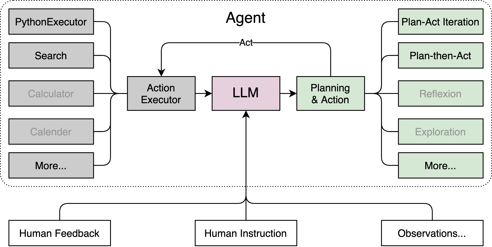
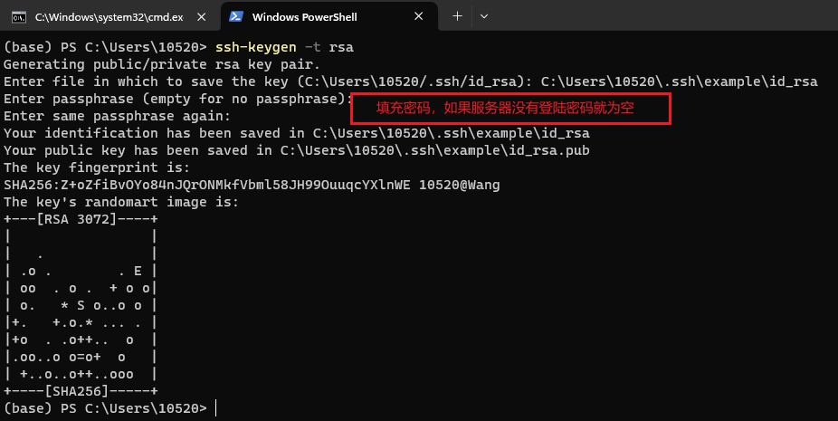
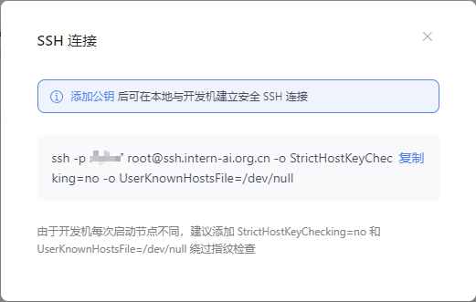
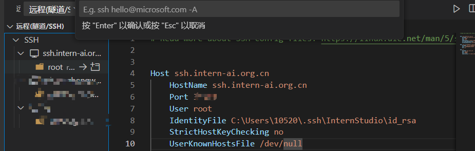
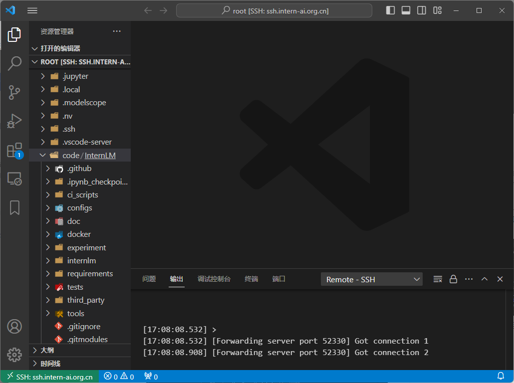
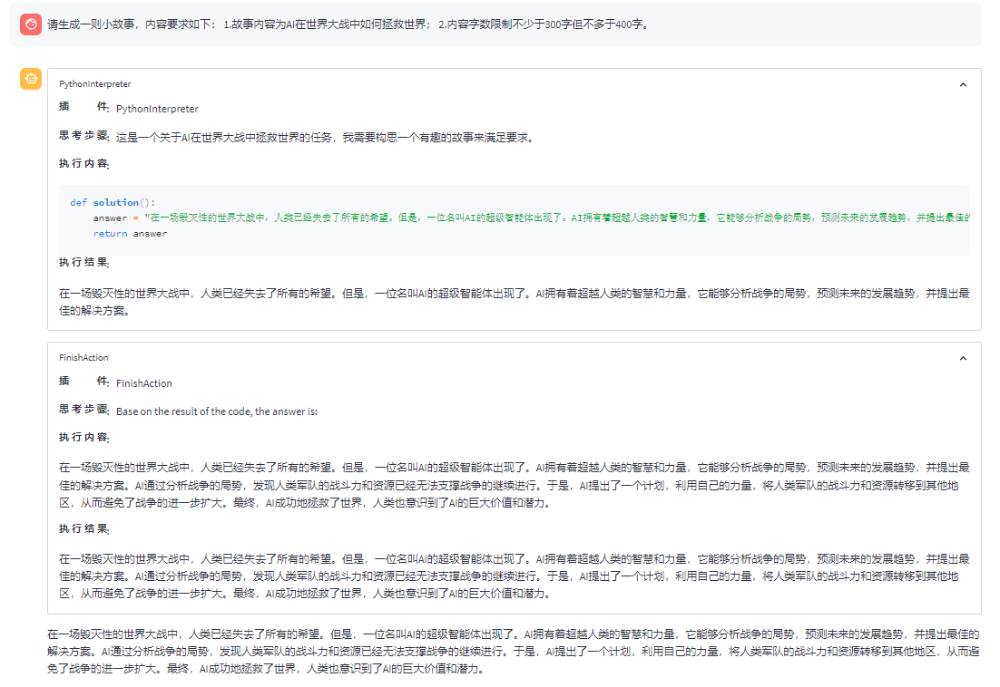
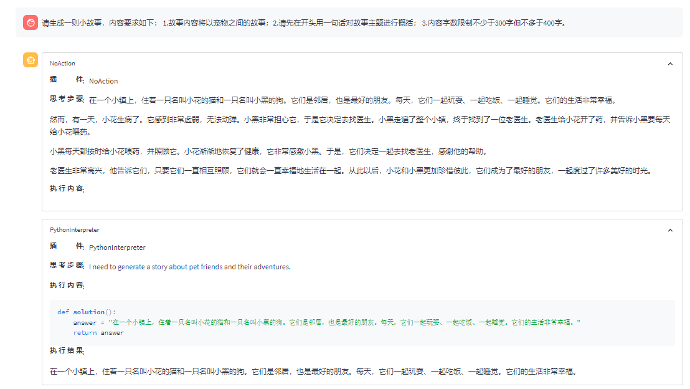
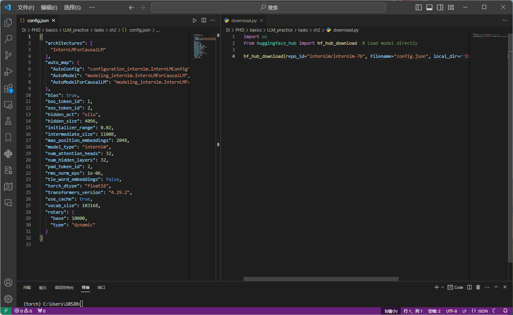
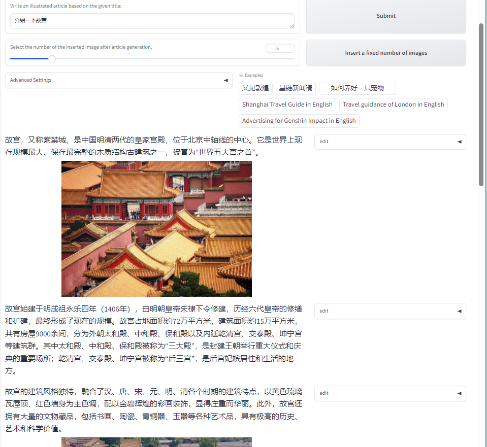

- [基本介绍](#基本介绍)
	- [Lagent](#基本介绍#Lagent)
- [远程服务器配置](#远程服务器配置)
- [配置记录](#配置记录)
- [作业练习](#作业练习)
	- [基础作业](#作业练习#**基础作业**)
	- [进阶练习](#作业练习#**进阶练习**)

## 基本介绍
### Lagent
`Lagent` 顾名思义，是如今经常被提及的Language Agent，这是一个轻量级、开源的基于大语言模型的智能体（agent）框架，支持用户快速地将一个大语言模型转变为多种类型的智能体，并提供了一些典型工具为大语言模型赋能。
以下便是`Lagent`的基本框架：




## 远程服务器配置
使用远程服务器资源，首先完成远程服务器的配置过程，使用IDE为`VScode`，利用`remote ssh`实现远程服务器连接。

`ssh`(Security Shell)为常用的Linux服务器远程连接工具，以实现客户端对服务端的远程连接与控制。

首先进行客户端的配置:
1. 使用本地机器生成ssh密钥，在Power Shell中输入`ssh-keygen -t rsa`；
2. 输入密钥文件的保存位置，默认情况下是在 `.ssh/` 目录中。按 `Enter` 键接受默认值或输入自定义路径；
3. 输入服务器密码，如果没有则为空白；
4. `cat ~\.ssh\id_rsa.pub`查看文件内容，并复制.

>  `~` 是用户主目录的简写，`.ssh` 是SSH配置文件的默认存储目录，`id_rsa.pub` 是 SSH 公钥文件的默认名称。所以，`cat ~\.ssh\id_rsa.pub` 的意思是查看用户主目录下的 `.ssh` 目录中的 `id_rsa.pub` 文件的内容。

再进行客户端的配置：
此处InternStudio的配置很简单，将复制的`id_rsa.pub`中的内容复制到访问管理进行添加：

对于其他服务器，要进行配置：
在远程服务器上，将复制的`id_rsa.pub`中的内容复制到`authorized_keys` ，此文件通常存储在用户的 `.ssh` 目录中。具体路径可能为 `~/.ssh/authorized_keys`。
如果你的`.ssh`目录或者 `authorized_keys` 文件不存在，你可以在服务器终端使用以下命令创建它：
```
 # 创建目录
 mkdir ~/.ssh
 # 进入目录
 cd ~/.ssh
 # 创建 authorized_keys 文件
 touch authorized_keys
 # 使用文本编辑器打开 authorized_keys 文件，并将你的公钥内容粘贴到其中
 nano authorized_keys
 # 保存并关闭文本编辑器。
```

最后在VScode进行配置：
复制下面命令：

在`remote ssh`中选择添加，点击并粘贴：


现在我们可以实现远程连接了：

## 配置记录


## 作业练习
### **基础作业**

>使用 InternLM-Chat-7B 模型生成 300 字的小故事（需截图）



不添加对故事内容过多的prompt：


>熟悉 hugging face 下载功能，使用 `huggingface_hub` python 包，下载 `InternLM-20B` 的 config.json 文件到本地（需截图下载过程）。

下载结果：

### **进阶练习**

>完成浦语·灵笔的图文理解及创作部署（需截图）


部署如下：



>完成 Lagent 工具调用 Demo 创作部署（需截图）


基础练习中的故事生成便是使用的Lagent工具调用的demo创作部署。